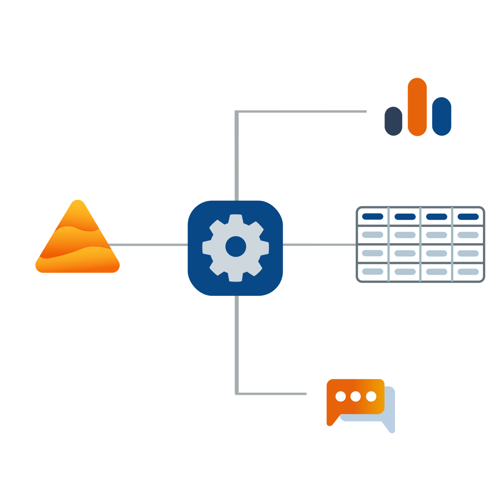

# Integrations

Set up connectors between Dastra and your other favorite applications to automate your workflows and save time.


[Go to the Dastra page of the Zapier catalog](https://zapier.com/apps/dastra/integrations)


### Introduction to Zapier&#x20;

Zapier is an online automation tool that connects your applications and services.&#x20;

You can connect two or more applications to automate repetitive tasks without having to code or hire developers to do the integration.&#x20;

With Zapier, you will set up Zaps (or integrations).&#x20;

A Zap is an automated workflow that links your applications and services together. Each Zap consists of a trigger and one or more actions. When you activate your Zap, it executes the action steps whenever the trigger event occurs.

### The three key concepts to remember:

* **Trigger:**\
  An event that triggers a Zap. For example, if you want to send an SMS every time you receive an email, the trigger is "new email in inbox".
* **Action:**\
  An event that a Zap executes after being triggered. For example, if you want to send a text message every time you receive an email, the action is "send a text message".
* **Zap:**\
  A trigger and a set of actions, all representing an automated workflow. For example, send an SMS every time you receive an email.

### Models for a quick setup

We have pre-configured automated workflow templates that you can set up in a few clicks.&#x20;

A dozen templates are already available and can be accessed from our [integrations page](https://www.dastra.eu/en/integrations) or directly from the [integrations section](https://app.dastra.eu/workspace/0/settings/integrations) of the Dastra web application.&#x20;

We will regularly put new templates online to meet your automation needs and save you precious time. Please feel free to submit your ideas for automated workflows so that we can propose them as templates.

### A fully customizable zap editor

If you want to automate a workflow for which we don't yet offer a template (or slightly customize an existing template to fit your situation), you can use [Zapier's Zap Editor](https://zapier.com/apps/dastra/integrations).&#x20;

The Zap Editor allows you to create a Zap from scratch, without having to type a single line of code. Choose the application you want to connect with Dastra from the [Zapier catalog](https://zapier.com/apps), set up a trigger and then select the action you want to perform.&#x20;

You can trigger actions in a third-party application from an event occurring in Dastra, or trigger an action in Dastra from an event in a third-party application.&#x20;

With over 4,000 Zapier-enabled applications, the automation possibilities are endless.

### What Dastra features are currently automatable in Dastra ?

As you can see, an integration is composed of a trigger and one or more actions. To date, we have set up 2 triggers and 6 actions on the Dastra side (It is important to understand that you are limited in terms of triggers and actions to what the Zapier compatible application editors make available to you). We will expand this list in the future to allow you to automate as many of Dastra's features as possible.

* **Available triggers:**

1. New Data subject request created
2. New task created

* **Available Actions:**

1. Create a taks
2. Create an actor
3. Create a data subject request
4. Link an actor to an existing data processing
5. Search an actor
6. Find or create an actor

You can start from one of the two triggers on the Dastra side to perform tasks in third-party applications, or start from a trigger in a third-party application to perform one of the six possible actions in Dastra.


[View the entire Zapier application library here.](https://zapier.com/apps)



View the [Zapier documentation](https://zapier.com/help) for more information on setting up a connector


Now you're ready to jump into the world of automation and set up your first connector.&#x20;

Follow our step-by-step guide to automating your data subject requests:


