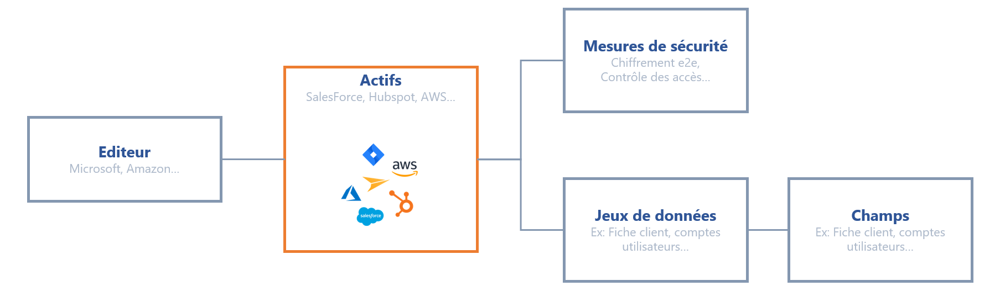

# Cartographie des données

#### Tout commence par une cartographie des donnnées 

Avant de vous lancer dans la constitution de vos fiches de traitement, nous vous recommandons de cartographier le plus précisémment possible les données de l'entreprise. Le schéma ci-dessous vous présente la structure de la cartographie que vous pouvez mettre en place.

<figure><figcaption>
Schéma de la cartographie de données 
</figcaption></figure>

Pour inventorier l'ensemble des données personnelles de votre SI, voici la procédure à suivre :

1. **Recenser les actifs (assets)** qui peuvent être des logiciels, des fichiers, des plugins, serveurs, machines...
2. **Identifier l'éditeur de l'actif (le cas échéant)** : saisissez les informations de la société qui produit cet actif. Celui-ci pourra être listé dans les sous-traitants lors de la constitution du registre.
3. **Inventorier les données** : lister le ou les jeux de données associés (vous pouvez vous référer au DPA signé avec le sous-traitant). Cliquez-ici pour en savoir plus sur [les jeux de données](https://doc.dastra.eu/features/editer-le-registre/remplir-le-questionnaire/categorie-de-donnees).
4. **Lister les mesures de sécurité** mises en place

Cette cartographie rendra beaucoup plus aisée la constitution de fiches de traitement en partant de la réalité de vos données.

Vous ne souhaitez pas faire cette inventaire ou vous estimez que les logiciels que vous utilisez sont standards ? Nous avons tout prévu, vous pouvez créer votre référentiel d'actif à l'aide de notre bibliothèque de modèles prédéfinis contenant les actifs standards du marché (Salesforce, Jira...).
