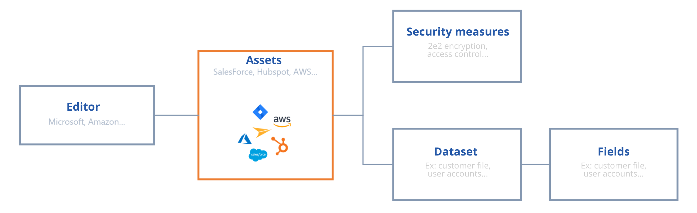

# Data Mapping

#### It all starts with data mapping

Before you start creating your treatment sheets, we recommend that you map the company's data as accurately as possible. The diagram below shows you the structure of the mapping that you can set up.

<figure><figcaption>
Diagram of the data mapping
</figcaption></figure>

To inventory all the personal data of your IS, here is the procedure to follow:&#x20;

1. **Identify the assets** which can be software, files, plugins, servers, machines...&#x20;
2. **Identify the publisher of the asset (if applicable)**: enter the information of the company that produces this asset. This can be listed in the subcontractors when the registry is created.&#x20;
3. **Inventory the data**: list the associated dataset(s) (you can refer to the DPA signed with the subcontractor). Click here to learn more about the [datasets](editer-le-registre/remplir-le-questionnaire/categorie-de-donnees.md).&#x20;
4. **List the security measures** in place.

This mapping will make it much easier to create treatment sheets based on the reality of your data.

You don't want to make this inventory or you think that the software you use is standard? We've got it covered, you can create your asset repository using our library of predefined templates containing standard assets from the market (Salesforce, Jira...).
