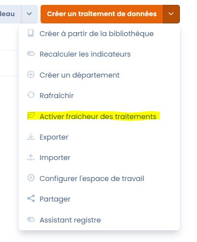
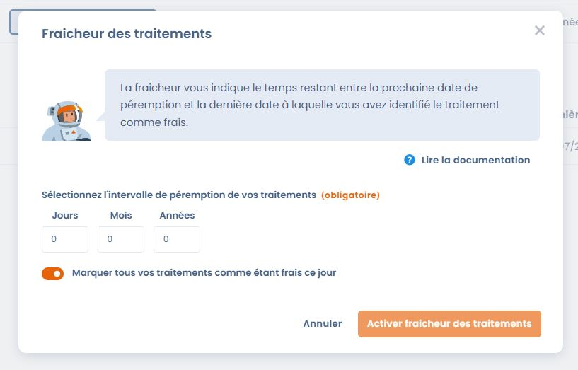
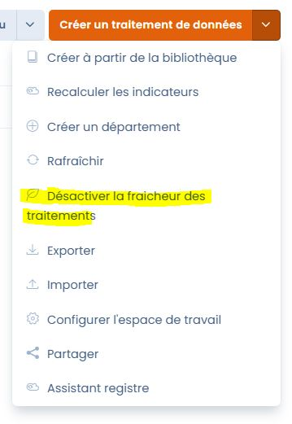

# Fraicheur des traitements

La fraicheur d'un traitement est un indicateur sur la dernière mise à jour d'un traitement. La fraicheur se dégradera au fur et à mesure que la date de péremption du traitement approchera. Cette fonctionnalité est un moyen simple et ludique pour garantir que les informations contenues dans votre registre des traitements sont toujours d'actualité.&#x20;

### Activer l'option fraicheur des traitements

La fraicheur des traitements est optionnelle et désactivée par défaut.&#x20;

Pour activer l'option, rendez-vous dans votre registre des traitements, cliquez sur le sélecteur d'actions du bouton "Créer un traitement de données" puis sur "Activer fraicheur des traitements".&#x20;

Cette action est réservée aux administrateurs de votre espace de travail.

<figure><figcaption></figcaption></figure>

La fenêtre suivante s'affiche et vous offre la possibilité de paramétrer **l'intervalle de péremption** de vos traitements. La fraicheur d'un traitement correspond au nombre de jours entre la dernière date à laquelle le traitement a été marqué comme frais et la date de péremption du traitement.&#x20;

La date de péremption est une date dans le futur calculée à partir de la dernière date à laquelle le traitement a été marqué comme frais à laquelle nous ajoutons **l'intervalle de péremption**. Veuillez noter que cet intervalle de péremption sera le même pour tous les traitements de votre registre.&#x20;

Une seconde option vous permet de marquer tous les traitements de votre registre comme frais au moment de l'activation de l'option (cela permet de lancer un cycle de fraicheur pour tous les traitements du registre immédiatement).

<figure><figcaption></figcaption></figure>

_Exemple: Nous sommes le 04/07/2023, j'active l'option fraicheur des traitements de mon registre et je paramètre un intervalle de péremption de 1 mois. Je coche l'option "marquer tous vos traitements comme étant frais ce jour" et je valide. La date de péremption pour mes traitements est calculée au 04/08/2023 (dernière date à laquelle mes traitements ont été marqués frais, le 04/07/2023, à laquelle nous ajoutons le l'intervalle de péremption, 1 mois). Je me reconnecte le 15/07/2023, mes traitements disposent encore de 20 jours de fraicheur (différence entre la date de péremption, et la date du jour)._&#x20;

### Désactiver l'option fraicheur des traitements

Pour désactiver l'option, rendez-vous dans votre registre des traitements, cliquez sur le sélecteur d'actions du bouton "Créer un traitement de données" puis sur "Désactiver l'option de fraicheur des traitements".

Cette action est réservée aux administrateurs de votre espace de travail.

Chaque traitement conservera sa dernière date à laquelle il a été marqué comme frais si vous décidez de réactiver l'option dans le futur.

<figure><figcaption></figcaption></figure>

### Les indicateurs de fraicheur

Une fois l'option activée, vous retrouverez des indicateurs de fraicheur de vos traitements à plusieurs emplacements.&#x20;

Veuillez noter que la fraicheur ne s'affiche que pour les **traitements publiés** et ayant été marqués au moins **une fois comme étant frais** (soit lors de l'activation de l'option via le sélecteur "marquer tous vos traitements comme étant frais ce jour", soit manuellement au niveau d'une fiche de traitement)

#### Dans le menu droit de votre fiche de traitement&#x20;

Vous retrouverez l'indicateur de fraicheur en haut à droite de votre fiche de traitement (dans la mesure ou le traitement a été publié et marqué comme étant frais au moins une fois)

Cet indicateur est composé d'un label prenant les valeurs "Frais", "Relativement frais" et "Périmé", d'une couleur (respectivement vers, jaune, rouge), d'une barre de progression diminuant à mesure que la date de péremption approche, d'un bouton pour marquer le traitement comme frais et du nombre de jours restants ou de retard par rapport à la date de péremption.&#x20;

<figure><figcaption></figcaption></figure>

<figure><figcaption>
En vue mobile, vous retrouvez également cet indicateur dans la barre de navigation en haut de votre fiche de traitement
</figcaption></figure>

<figure><figcaption>
Exemple de traitement périmé
</figcaption></figure>

#### Dans la colonne fraicheur de votre registre de traitement

En affichant la colonne fraicheur dans la vue liste de votre registre de traitements, vous retrouvez l'indicateur pour chaque fiche de traitement remplissant les conditions d'affichage (traitement publié disposant d'au moins une date à laquelle il a été identifié comme frais)\

<figure><figcaption>
Colonne fraicheur dans un registre de traitements ou l'option fraicheur des traitements est active
</figcaption></figure>

### Rafraichir un traitement

Vous pouvez à tout moment, et sans forcément attendre la date de péremption, décider de rafraichir un traitement. Pour ce faire, cliquez sur "marquer comme frais" pour afficher la fenêtre de rafraichissement d'un traitement (en affichage mobile, cette fenêtre est accessible en cliquant sur l'icône de fraicheur feuille) :

<figure><figcaption>
fenêtre de rafraichissement d'un traitement
</figcaption></figure>

En marquant le traitement comme frais, vous relancerez un cycle de fraicheur à partir de la date du jour et ce jusqu'à la prochaine date de péremption. La date de péremption est calculée par défaut en fonction de la politique de fraicheur de votre espace de travail (intervalle de fraicheur appliqué lors de l'activation de l'option fraicheur des traitement). Vous pouvez décider d'ignorer cette date par défaut et appliquer une date de péremption spécifique à ce traitement en cochant l'option "Changer la date de péremption" et en sélectionnant une nouvelle date (la date de péremption doit au minimum être fixé à J+1)

### Information importante sur le fonctionnement de la fraicheur

Veuillez noter que nous traitons indépendamment la date de mise à jour d'une fiche de traitement (lors d'une sauvegarde de la fiche par exemple) de la date à laquelle un traitement a été identifié comme frais. Il est donc nécessaire de cliquer sur "marquer comme frais" pour (ré) initialiser la date de fraicheur d'une fiche de traitement.

### Notifications

Le propriétaire d'un traitement qui passe à l'état périmé recevra un email d'avertissement pour lui rappeler que l'un de ses traitement n'a pas été révisé depuis longtemps et qu'il est temps de le rafraichir.
