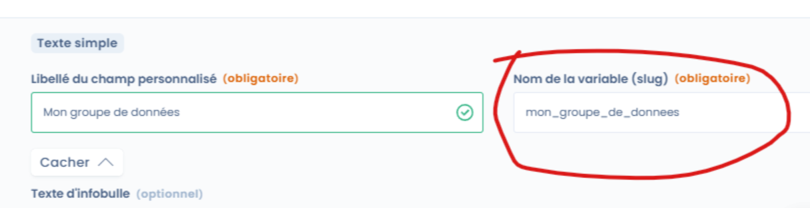

# Questions fréquentes

## Comment afficher l'historique des modifications sur un traitement ?

Pour tous les traitements, vous pouvez afficher l'historique des modifications ainsi que le détail des changements.&#x20;

Il suffit de cliquer sur l'icone en haut de la page représentant une horloge.

<figure><figcaption>
Bouton d'accès à l'historique
</figcaption></figure>

Attention, les modifications d'unités organisationnelles ne sont pas tracées.&#x20;


Si vous ne trouvez la réponse dans ce guide, vous pouvez nous [contacter via le support](../../commencer/le-support/faire-une-demande-de-support.md)


