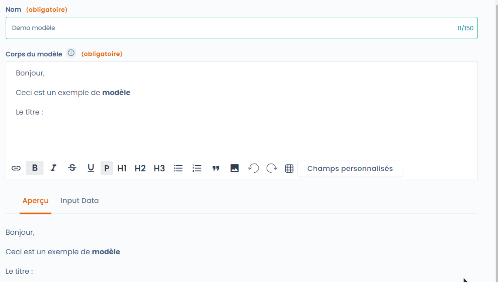
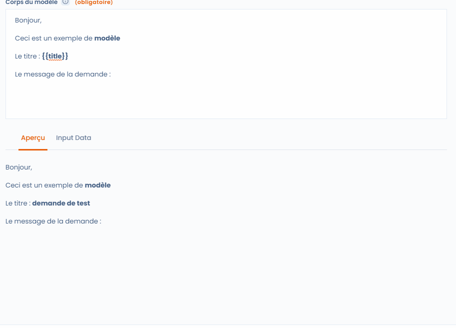

# Modèles email

## Généralités

Les modèles de mail sont une fonctionnalité présente dans les exercices de droit, les workflows personnalisés ainsi que les audits.

Une fois enregistré, ils sont un moyen rapide pour communiquer avec les parties prenantes. L'ensemble de données d'un objet peut y être incorporé et il est même possible de mettre en place des conditions et des boucles pour récupérer plus d'informations.

## Utilisation

Pour sélectionner ou créer un modèle, cliquez sur "Sélectionner ou créer un modèle "

<figure><figcaption><p>Sélection du modèle dans un exercice de droit</p></figcaption></figure>

Vous pouvez ensuite chercher un modèle existant dans la liste ou la fonction rechercher, ou regarder les modèles disponibles dans les espaces de travail auquel vous avec accès ou encore les modèles créés par Dastra).

Si aucun modèle ne vous convient, cliquez sur "Créer modèle"

<figure><figcaption><p>Sélection ou création d'un modèle</p></figcaption></figure>

L'interface de création de modèle comprend 4 éléments&#x20;

* Le nom (permettra de retrouver le modèle plus tard)
* La zone de saisie (Corps du modèle, encadrée en vert)
* Un onglet Aperçu : permet d'afficher le rendu du mail en temps réel
* Un onglet Input Data : vous permet de voir les données de l'objet concerné par le modèle

<figure><figcaption><p>Interface de création de modèle</p></figcaption></figure>

## Personnalisez le modèle

Vous pouvez éditer le modèle et appliquer des styles, insérer des images ou des tableaux selon vos besoins. Vous verrez le résultat dans l'onglet aperçu. Si vous cliquez sur "Champs personnalisés" vous aurez accès à une liste de champs à insérer. La valeur du champ sera insérée au niveau du curseur de la souris. Bien entendu, vous pouvez formatter le texte à votre convenance.

<figure><figcaption><p>Utilisez les champs personnalisés</p></figcaption></figure>

## Aller plus loin avec les champs personnalisés

Comme vous pouvez le voir sur l'animation ci-dessus, les champs entourés par des doubles accolades sont des "variables". C'est à dire qu'elles vont être remplacées par les valeurs de l'objet correspondant (ici une demande d'exercice de droit).

### Créez de nouveau champs personnalisés à partir de l'Input Data

En cliquant sur l'onglet "Input Data", vous aurez accès à la liste des propriétés de l'objet lié. Dans l'exemple ci-dessous, je décide d'afficher le message lié la demande :&#x20;

* Je cherche le champ dans "Input Data"
* Je saisie le nom du champ dans le Corps du message avec la syntaxe \{{message\}}
* Je vérifie le résultat avec l'onglet "Aperçu"

<figure><figcaption><p>Création d'un champ personnalisé à partir d'Input Data</p></figcaption></figure>

Voilà ! Vous êtes maintenant capables de créer vos propres champs personnalisés. Mais ce n'est pas tout ! Vous pouvez également aller encore plus loin en créant les boucles, des conditions et en appliquant des format pour rendre les dates plus lisibles !

### Les conditions

Il est également possible de créer des blocs conditionnels qi ne s'afficheront que dans certaines conditions.

Pour cela, il faut utiliser le système de balise conditionnelle qui commence avec \{% if qqch == true %\} et finit avec \{% endif %\}

&#x20;Ainsi, je peux écrire la condition suivante :&#x20;

> \{% if attachments != blank %\}
>
> Vous avez une pièce jointe
>
> \{% endif %\}

Le bloc ne s'affichera que si une pièce jointe est présente dans la demande

### Les boucles

Les boucles fonctionnent de la même manière, sauf que cette fois on va générer une variable interne à la boucle.

Ca fonctionne de la manière suivante :&#x20;

```liquid


  {{ purpose }}

i
```

Dans l'exemple ci dessus, je déclare vouloir faire une boucle sur la liste "purposes" et affecter la variable "_purpose_" à chaque élément que j'affiche directement.

### Format des dates

Vous verrez rapidement que les dates que vous récupérez dans Input Data ne sont pas présentables en l'état. Pas de problèmes, il est possible d'affecter un format à la date.

> \{{dateCreation | date: "%d-%m-%Y à %H:%M"\}}
>
> Sera transformé en 15-03-2023 à 15:40

### Un exemple plus complexe

Le corps de texte ci-dessous utilise tous les éléments ci-dessus

> Bonjour,
>
> Nous avons bien reçu votre demande d'exercice de droit le \{{dateCreation | date: "%d-%m-%Y à %H:%M"\}} concernant Monsieur ou Madame \{{givenName\}} \{{familyName\}}.
>
> La demande porte sur les finalités suivantes :
>
> \{% for purpose in purposes %\}
>
> * \{{ purpose \}}
>
> \{% endfor %\}
>
> \{% if attachments != blank %\}
>
> Nous avons bien reçu les pièces suivantes :
>
> \{% for attachment in attachments %\}
>
> * \{{ attachment.fileName \}}
>
> \{% endfor %\}
>
> \{% endif %\}
>
> Je vous pris d'agréer mes plus sincères salutations et ne manquerais de vous tenir informé-e de la suite du traitement de votre demande.
>
> Cordialement,
>
> \{{operator.displayName\}}

Pour la demande en cours de traitement, il sera transformé de la manière suivante :&#x20;

<figure><figcaption><p>Un exemple de modèle complet</p></figcaption></figure>

### Vous avez encore des besoins ?

Vous pouvez consulter la documentation à l'adresse suivante : [https://shopify.github.io/liquid/](https://shopify.github.io/liquid/)
