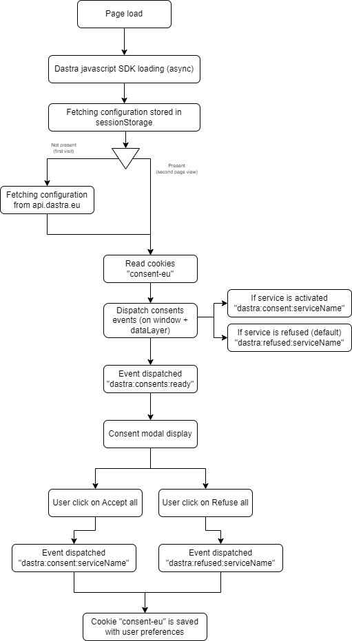

# Blocage des cookies

Pour réaliser un blocage effectif des cookies, il existe plusieurs méthodes possibles : la suppression des cookies, le blocage d'un snippet, le javascript personnalisé ou Google Tag Manager.

## Suppression des cookies

Cette méthode est la plus rapide à mettre en place, mais aussi la moins fiable. Dans le panel de configuration du widget Dastra, si vous renseignez le nom des cookies associés à chaque service, cela supprimera automatiquement les cookies concernés à chaque affichage de page.&#x20;

.png>)

Ce fonctionnement peut-être effectif dans certain cas, mais risque de perturber de manière importante la fiabilité des outils tiers utilisés (Outils de web analytique notamment). Il est très souvent préférable d'utiliser en complément une autre des méthodes ci-dessous.

## Bloquer un snippet de code dans la page

Cette méthode permet de désactiver totalement un snippet de code de suivi de la page.

Pour cela, remplacez dans le code html de votre page le snippet de code suivant :

```markup
<script >
  alert("hello, I'm a tracking javascript tag");
</script>
```

Par :

```markup
<script data-consent="{your-service-slug}" type="dastra/script">
   alert("hello, I'm a tracking javascript tag");
</script>
```

Remplacez le "{your-service-slug}" par l'identifiant de votre service saisi lors de la config de votre widget :

.png>)

Si le client a accepté les cookie, le contenu du script sera automatiquement exécuté.


Ce fonctionnement peut avoir plusieurs effets de bord : notamment des problèmes de highlight de la synthaxe dans la plupart des IDEs.&#x20;

Le bout de script ne sera pas du tout exécuté dans le cas d'une erreur d'implémentation du widget de Dastra.


### Blocage en pur javascript

En pur javascript, vous pouvez utiliser les évènements déclenchés sur le window pour collecter le consentement et gérer un comportement particulier selon l'acceptation et le refus des cookies. Ce fonctionnement vous donnera une plus grande souplesse :

```javascript
<script>
  (function(){

      /* 
      * Trigger  a custom servicve tag with expected cookies
      */
      function customTagsTrigger () {
        /* If the vendor provide a specific function for making the service work cookie-less, pull it here.
        * Else copy the default code snippet provided by the tag vendors*/
      }

      /*
      * Handle the global scope consent event
      * If the user has consented to custom vendor's tag cookies, this event will be fired on each page load where the cookie consent widget is installed
      */
      window.addEventListener('dastra:consent:{your-service-slug}', function () {
        /* The client is optin to the custom vendor's cookies here */
        customTagsTrigger();
        console.log('{your-service-slug} accepted')
      });

      /* Uncomment this if you want to handle the refused event
      *  Handle global scope refused event event (Optional) 
      */
        window.addEventListener('dastra:refused:{your-service-slug}', function () {
         // The custom's services cookies are refused 
         console.log('{your-service-slug} cookies refused')
       });
      
  });
  </script>
```

### Google Tag Manager

Voir page suivante:


[google-tag-manager.md](google-tag-manager.md)


### Rappel sur le cycle de vie du consentement :&#x20;

<figure><figcaption><p>Cookie widget lifecycle</p></figcaption></figure>

### Evènements javascript

Par défaut, le widget émet plusieurs évènements sur l'élément window de la page :&#x20;

| Nom de l'évènement                | Remarques                                                                                                                                                                                                                        |
| --------------------------------- | -------------------------------------------------------------------------------------------------------------------------------------------------------------------------------------------------------------------------------- |
| dastra:consent:\<slug du service> | Se déclenche quand le service a été accepté par l'utilisateur (les cookies nécessaires ne sont pas concernés). Si le service est en mode "consenti par défaut" cet évènement sera déclenché dès le premier chargement de la page |
| dastra:refused:\<slug du service> | Se déclenche dans le cas où le service n'a pas été activé par l'utilisateur (par défaut si aucun consentement n'est donné) ou si un refus explicite a été donné.                                                                 |
| dastra:consents:ready             | Se déclenche quand le cookie de consentement (consent-eu) a été lu et décodé.                                                                                                                                                    |
| dastra:consents:updated           | Se déclenche si les consentements ont été mis à jour par l'utilisateur (accepté, refusé ou configuré)                                                                                                                            |
| dastra:consents:any\_refused      | Se déclenche si au moins un cookie a été refusé explicitement par l'utilisateur via la modal                                                                                                                                     |
| dastra:consents:all\_accepted     | Se déclenche si tous les services ont été acceptés par l'utilisateur via la modal                                                                                                                                                |
