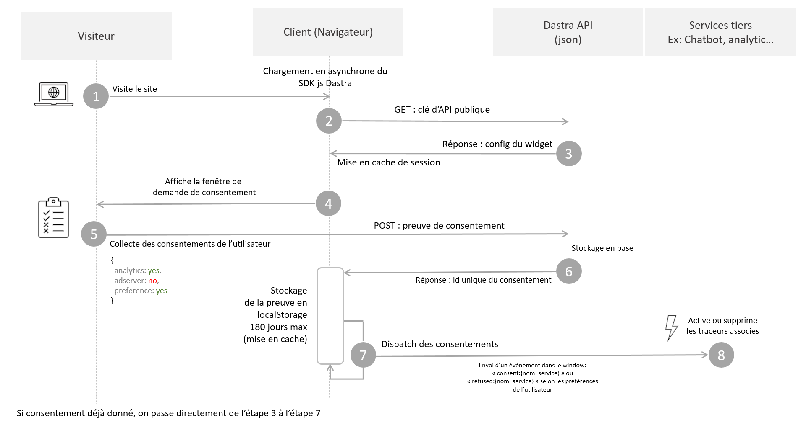

# Fonctionnement du widget

## Fonctionnement global :

Globalement, le widget de consentement fonctionne en 3 grandes étapes :

1. La **proposition** de la fenêtre de consentement
2. La **collecte** du consentement (stockage des preuves)
3. **L'exécution** réelle du consentement de l'utilisateur


Le widget Dastra permet de couvrir les deux premières étapes de manière partiellement automatique. Pour la troisième étape consistant à appliquer réellement les préférences de l'utilisateur en matière de cookies, vous allez avoir besoin d'intégrer techniquement le système de consentement aux services tiers pouvant potentiellement poser des cookies. Consultez le [guide de blocage des cookies](blocage-des-cookies/) pour plus d'informations/


Le SDK javascript du widget doit être appelé sur toutes les pages du site utilisant les cookies.



### 1. Visite sur le site du client

L'internaute visite le site web où le snippet de code js est installé. De manière à ne pas impacter les performances et le SEO des pages webs, le SDK est chargé de manière totalement asynchrone avec une durée de mise en cache d'une journée.

### 2. et 3. : Collecte et mise en cache de la configuration du widget

Pour que le widget fonctionne correctement sur le site, il va avoir besoin d'une configuration de client à jour récupérée depuis les serveurs de Dastra. Pour avoir la version la plus fraîche possible, celui-ci va effectuer une requête GET du widget avec la clé d'API publique pour contrôler l'appartenance du widget au client.


Si le client n'a pas correctement renseigné son domaine dans l'éditeur de widget, celui-ci n'autorisera pas la requête et il sera impossible d'afficher correctement le widget. Pour remédier à cela, rendez vous [sur cette page](https://app.dastra.eu/workspace/19/cookie-widget/list), choisissez votre widget et ajoutez le domaine manquant.


### 4. Demande du consentement à l'utilisateur

Si le cookie "euconsent" (vous pouvez choisir le nom du cookie si vous le souhaitez) est absent, la fenêtre de consentement s'affichera. Pour tester le bon affichage du widget, vous pouvez supprimer ce cookie de votre navigateur.&#x20;

### 5. La collecte du consentement

Les consentements seront automatiquement collectés par l'API de Dastra via une requête POST en json.&#x20;

Bien que dans l'interface du widget, l'expression du consentement s'effectue par finalité, le stockage quant à lui, s'effectue par service.

Voici à quoi ressemble la preuve de consentement telle qu'elle est stockée dans nos bases :

```javascript
{
    "id": "6185fe65-0924-410d-9132-3cde838c4627",
    "sessionId": "0b93b823-ff36-4d61-8959-e9e8deee5ef8",
    "date": "2020-05-19T16:54:03.272Z",
    "dateExpiration": "2020-11-19T16:54:03.272Z",
    "type": 2,
    "widgetId": 43,
    "typeDevice": 2,
    "workSpaceId": 19,
    "consentId": "8a5e89c4-2243-4598-97c5-ba3cfb35a138",
    "consents": {
        "lang": "fr-FR",
        "versionKey": null,
        "cookieConsents": [
            {
                "id": "584ffef3-251c-4e9a-efb8-08d7fbfbee92",
                "tenantId": 0,
                "name": "Drift",
                "slug": "drift",
                "consent": true,
                "version": "6f65cb1d-85eb-4a64-976d-519679189f8d",
                "date": "2020-05-19T16:53:59.511Z",
                "purpose": 3
            }, {
                "id": "1c3baa61-0d05-44e4-da3d-08d7eeadee05",
                "tenantId": 0,
                "name": "Google Analytics (universal)",
                "slug": "analytics",
                "consent": true,
                "version": "6f65cb1d-85eb-4a64-976d-519679189f8d",
                "date": "2020-05-19T16:54:00.568Z",
                "purpose": 2
            }
        ]
    }
}
```

&#x20;En retour, l'api renverra une chaîne nommée "consentId" qui sera ensuite stockée dans le navigateur dans le localStorage pour une durée de 180 jours max. Cette chaîne est l'identifiant unique de la preuve de consentement. Dans le cas d'un litige, c'est cet identifiant qu'il faudra chercher dans le navigateur du client.

### 6. L'exécution du consentement

Lorsque nous avons collecté le consentement de l'utilisateur, il est désormais nécessaire d'exécuter réellement son souhait en transmettant à l'ensemble des services du site les informations de consentement.

Pour cette phase, nous vous invitons à consulter le guide sur le blocage des cookies :


[blocage-des-cookies](blocage-des-cookies/)




A l'exception des cookies strictement nécessaires, l'intégralité des services tiers effectuant du traçage doivent être bloqués par défaut.&#x20;


Bravo, vous êtes prêt à démarrer l'intégration technique du widget:


[integration-dans-les-cms](integration-dans-les-cms/)


