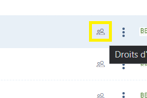

# Data subject right request

With the GDPR, European citizens are able to ask a company or organization processing personal data about them to exercise their rights.


[droits-des-personnes.md](../../le-rgpd-en-bref/rgpd-en-bref/droits-des-personnes.md)


To do this, the company or organization must set up a register of requests to exercise rights as well as a dedicated process.

## The register of data subject rights requests

Dastra allows you to constitute a register of requests for the exercise of rights centralizing all past, present and future requests. This is available by clicking on the "exercise of rights" tab in the banner on the left of the screen.

<figure><figcaption></figcaption></figure>

## Complete a new data subject rights request

There are 3 ways to fill in a new data subject rights request in DASTRA:

1. [Inform directly by hand any new data subject right requests](https://app.gitbook.com/s/-LvBxs22wUMicv9uWp6C-2584506019/features/gerer-les-exercices-des-droits/gestion-des-demandes-dexercices-de-droits)&#x20;
2. Import requests by excel, csv or text file. Read our [guide to importing data](https://app.gitbook.com/s/-LvBxs22wUMicv9uWp6C-2584506019/features/generalites/importer-vos-donnees-excel-csv) into Dastra
3. [Set up a data subject right widget](https://app.gitbook.com/s/-LvBxs22wUMicv9uWp6C-2584506019/features/gerer-les-exercices-des-droits/implementez-un-widget-dexercice-des-droits)

### Manual creation of a data subject rights request

By clicking on the "Add a data subject right request" button, a window appears where you can detail the data subject right request. Click on "Save and exit". That's it, you have created your first data subject right request manually!

<figure><figcaption></figcaption></figure>

### Import / export of the data subject right request register

The entire request register is importable and exportable. To import a request, click on the arrow next to the "add a data subject right request" button

<figure><figcaption></figcaption></figure>

A window appears with an "import" button. Click on it, download the registry template and follow the instructions to import the requests into Dastra. Once imported, the request will be directly available in the request register.

<figure><figcaption></figcaption></figure>

### Implementation of data subject right request widget

Data subject right requests can also come from a specific widget that can be configured from the Dastra platform.

See our [guide on how to set up the data subject rights widget](implementez-un-widget-dexercice-des-droits.md)


[implementez-un-widget-dexercice-des-droits.md](implementez-un-widget-dexercice-des-droits.md)


