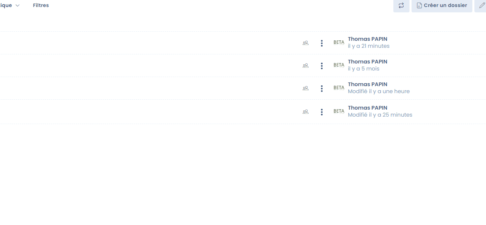

# Gestion de documents (GED)

Dastra intègre nativement une fonctionnalité de gestion de documents.&#x20;

Ce module permet de centraliser et mutualiser l'accès à tous les documents associés dans Dastra.

C'est par exemple ici que vous pouvez stocker toute la documentation utile pour prouver votre conformité au RGPD.


**Focus sur la documentation RGPD**

&#x20;

L’exigence de documentation découle du **principe de responsabilité** (accountability) rappelé à l’article 24 du RGPD.

Cette documentation se traduit en pratique en premier lieu par le registre des activités de traitement mais également à travers d’autres éléments de gestion des données et de la conformité au RGPD. **Il peut s’agir des éléments suivants (liste non exhaustive) :**

* procédures internes encadrant la création d’un nouveau traitement de données à caractère personnel (contrôle interne, évaluation des risques et de la proportionnalité, etc.)
* procédure de réalisation des PIA
* mise en place de politiques de protection des données écrites et contraignantes, à prendre en compte et à appliquer aux nouvelles opérations de traitement des données (par exemple, conformité aux critères de qualité des données, préavis, principes de sécurité, consultation, etc.), lesquelles devraient être mises à la disposition des personnes concernées
* mappage des procédures en vue de veiller au bon recensement de toutes les opérations de traitement des données et gestion d’un inventaire de celles-ci
* mise en place de programmes de formation pour les personnes en charge de la gestion des traitements de données
* mise en place de procédures de gestion des demandes d'accès, de rectification et d'effacement et des droits détenus par les personnes concernées sur les données
* mise sur pied d’un mécanisme interne de gestion des plaintes
* élaboration de procédures internes pour une gestion et une notification efficaces des violations de données
* réalisation d’évaluations d’impact sur la vie privée dans certaines circonstances
* mise en œuvre et supervision de procédures de vérification afin de s’assurer que toutes les mesures n’existent pas seulement sur papier, mais qu’elles sont aussi mises en œuvre et fonctionnent dans la pratique (audits internes ou externes, etc.).

Vous pouvez également dans cet espace **stocker tout document utile à la compréhension des traitements, les notes de formation ainsi que les contrats encadrant le traitement le cas échéant**.


### Les formats acceptés

De nombreux formats sont acceptés :

* pdf
* word
* excel
* jpg
* zip
* etc

Si un format n'est pas accepté, vous pouvez mettre le ficher dans une archive .zip pour l'intégrer dans la documentation.&#x20;

### Créer un document

Avec Dastra, vous pouvez créer rapidement un document pour prise de note.&#x20;

Pour cela, allez dans la gestion de documents et cliquez sur "Ecrire un document"

&#x20;

<figure><figcaption>
Ecrire un nouveau document
</figcaption></figure>

Le nouveau document est enregistré au format markdown (.md)

<figure><figcaption></figcaption></figure>

### Créer un dossier

Vous pouvez ranger vos documents dans des dossiers pour les retrouver facilement.&#x20;

Il est possible de créer des sous-dossiers.

<figure><figcaption></figcaption></figure>

### Gestion des droits

Il est possible de rajouter des droits sur les dossiers et fichiers de la GED. Ces droits peuvent être affectés aux dossiers comme aux fichiers et peuvent être configurés par l'administrateur de l'espace de travail ou un utilisateur ayant la permission "Gestion des fichiers : gestion".


Important : Par défaut, aucune restriction n'est appliquée sur l'arborescence des dossiers. Les permissions liées aux rôles de l'utilisateur sont toutefois appliquées !&#x20;


Le propriétaire de l'espace de travail (ou administrateur) peut configurer les droits d'accès en cliquant sur l'icône de configuration sur ligne correspondante. Il peut ensuite configurer les accès en ajoutant les équipes et utilisateur avec la permission d'exécution associée.

&#x20;

<figure><figcaption>
Interface de gestion des interfaces
</figcaption></figure>

Ces permissions sont appliquées à tous les éléments "enfants" (c'est à dire tous les éléments contenus dans le dossier, ce qui implique donc les sous-dossiers).&#x20;


Un dossier pour lequel aucune permission n'est défini est considéré comme accessible par l'ensemble des utilisateurs.

Si des permissions ont été définies ou sont héritées sur un élément, celui-ci sera caché pour les utilisateurs n'ayant pas les habilitations nécessaires.

