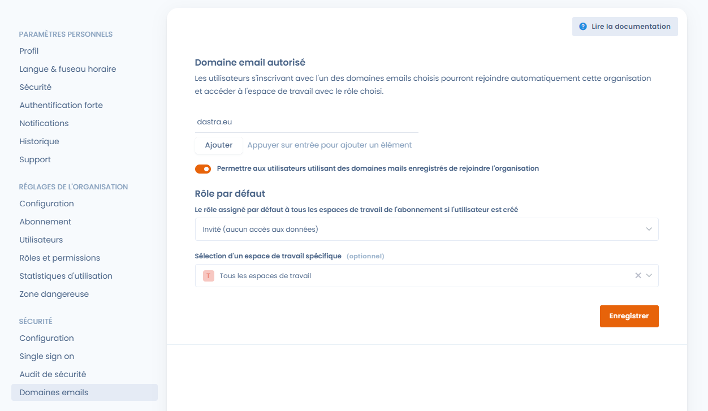
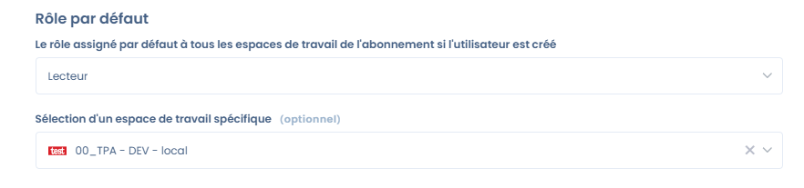
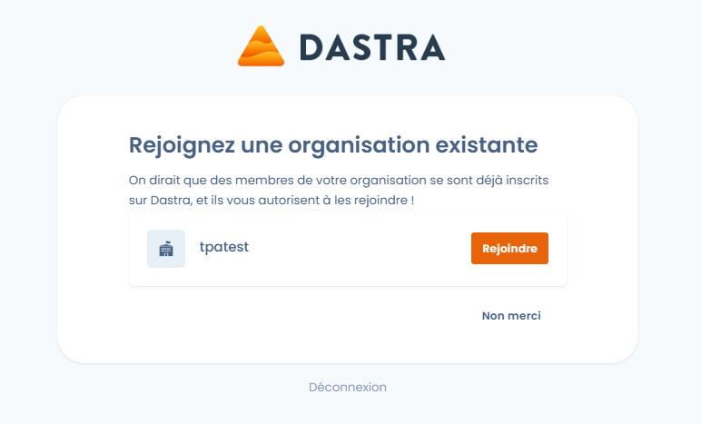

# Email domains

## What are they used for?

Email domains allow your future collaborators the possibility to be directly assigned to a workspace with the chosen role without any action on your part.

## How to use them?

You will find the email domains configuration in the general settings of your organization, under the **security** section.

<figure><figcaption>
emails domains configuration
</figcaption></figure>

Activate or deactivate the feature by clicking on the button 'Allow users...'

Then choose the role and workspace that will be assigned to future users:

<figure><figcaption></figcaption></figure>

Finally, save the configuration by clicking on the Save button!


**Restrictions:**

You are only allowed to add email domains that have been previously authorized (i.e., for which a user in your organization has validated an email address). Personal-type domains (gmail, hotmail, etc.) or those identified as 'disposable' are prohibited!&#x20;


## Impact for Future Users

The next time a collaborator signs up on Dastra, they will still need to enter their email address and validate it. However, they will now be offered to join your organization!

<figure><figcaption></figcaption></figure>

They will then be able to join you and start working with you!
