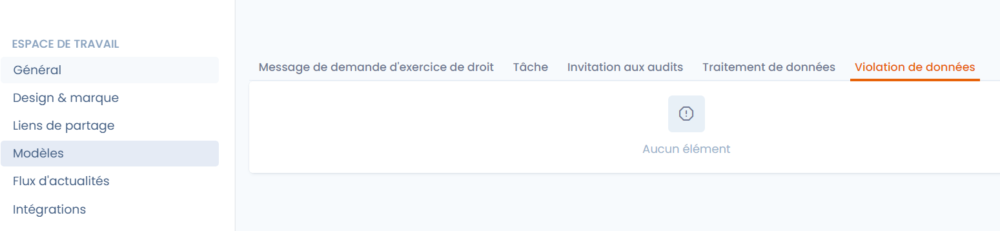
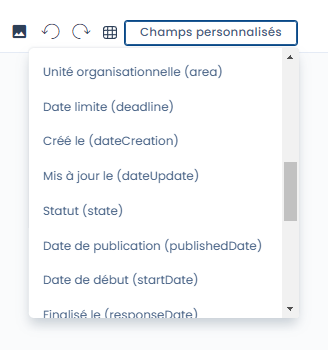

# Message templates

## Customization of Message Templates

To optimize your time and increase efficiency, you can set up message templates for reuse in Dastra modules.&#x20;

### Types of Accessible Message Templates"

<figure><figcaption></figcaption></figure>

The types of models are as follows:

* **Message in the exercise of rights requests**\
  During exchanges with applicants, you can save templates to save time. For example, a model of acknowledgment of receipt of the request.
* **Task**\
  You can customize the content of the description of a task. Ideal for saving time on repetitive tasks. For example, when you ask someone to provide details on data processing, you can reuse the same message template.
* **Audits**\
  You can customize invitations to respond to an audit. Use a template here to enter the same message for all your respondents. For example, you can invite your subcontractors to complete an audit to verify the proper application of the subcontracting contract using a model created in the image of your organization.
* **Complete a Process**\
  You can invite a Dastra user to complete a data processing from a step. Write the model once or select a model based on the quality of the recipient (lawyer, CIO, etc.) to save time.
* **Complete a Data Breach**\
  You can invite a Dastra user to complete a data breach from a step. Write the model once or select a model based on the quality of the recipient (lawyer, CIO, etc.) to save time.

### Model Creation

The creation of a model can be done either from the workspace settings or from the location of the message.

Click on Create model

Do not forget to save your work!

### Custom Variables in Templates

Dastra allows you to automatically fill the model with custom variables.

This means that you can automatically include information about the object linked to the model in the message template text.

For example, in the invitation to respond to an audit, it will be possible to automatically include the audit's due date.

<figure><figcaption>
Custom fields of the invitation message to respond to an audit
</figcaption></figure>

You can easily add dynamic fields directly into the template. As a template creation language, we use LiquidJS syntax.

Here is the complete [guide](https://liquidjs.com/tags/overview.html): tags and [filters](https://liquidjs.com/filters/overview.html).

To translate statuses, you can use the custom filter getTranslation in this way \{{data | getTranslation: ''\}}. Example: \{{data | getTranslation: 'dataSubjectRequestStates'\}}.

### Detail of Variable Fields:

**Message of Right Exercise Request:**

* Request Title (title)
* Closed by (closedByUser)
* Organizational Unit (area)
* Created by (creator)
* Operator (operator)
* Language (locale)
* Archived (archived)
* Archived on (archivedDate)
* Category of Person (subjectCategory)
* Complex Request (complex)
* Closing Date (dateClosed)
* Additional Information (internal) (description)
* Request Message (message)
* Email (email)
* Phone Number (phoneNumber)
* First Name (givenName)
* Last Name (familyName)
* Updated on (dateUpdate)
* Ref. Id (refId)
* User ID (userId)
* Reason for Closing (closedReason)
* Description of Closing (closedReasonDescription)
* Expiry Date (expiryTime)
* Address (address)
* Postal Code (zipCode)
* City (city)
* Country (countryCode)
* Email Validation Date (emailValidationDate)
* Email Validated (mailValidated)
* Source URL (referrerUrl)
* Identity Validated (identityValidated)
* Date of Identity Validation (dateIdentityValidated)
* Request ID (demandId)
* Status (state)
* Date (dateCreation)
* Workflow Step (workFlowStep)
* Collection Channel (channel)
* Types of Rights (purposes)
* Messages (nbMessages)
* Remaining Days (remainingDays)
* Closing Time (days) (closingTime)
* Tags (tags)

I**nvitations to Complete a Process:**

Organizational Unit (area)

Workflow Step (workflowStep)

ID (id)

Source (source)

Name (label)

Status (state)

Created on (dateCreation)

Archiving Date (dateArchived)

Archived (archived)

Version Description (versionDescription)&#x20;

ype (processingType)

Organizational Unit (areaId)

Assets (assets)

Internal Reference (ref)

Processing State (processingState)

Documentation (descriptionHtml)

Tags (tags)

Processing Owner (owner)

Stakeholders (stakeHolders)

DPIA Required (isDPIARequired)

DPIA Date (dpiaDate)

Exempted from DPIA (dpiaExemption)

Recipients (recipients)

Data Controllers / Clients (dataControllers)

Data Sets (dataRetentionRules)

Purposes (purposes)

Measures (securityMeasures)

Categories of Concerned Persons (personCategories)

DPIA (customFields.aipd)

Progress (%) (progression)

Quality (%) (quality)

Sensitivity (%) (sensitivity)

Created by (creatorUser)

Deployment Date (dateDeployment)

Publication Date (datePublication)

Last Modified (dateUpdate)

Description (description)

**Invitation to Complete a Breach:**

Name (label) ID (id)

Data Location (location)

Loss of Confidentiality (access)

Loss of Integrity (integrity)

Loss of Availability (availability)

&#x20;Cause (reason)

Source (source)

Involved Processors (processorInvolved)

Processors (processors)

Sensitive Data (sensitiveData)

&#x20;Probability Score (probabilityScore)

&#x20;Impact Level (impactScore)

Score (score)

Risk Level (riskLevel)

Data Record Volume (dataVolume)

Data Support (dataSupport)

Communication Done? (communicationDone)

Reason for No Communication (noCommunicationReason)

Period (period)

Start Date (startDate)

End Date (endDate)

Detection Date (constatationDate)

Notification Deadline to the Controlling Authority (notificationDueTime)

Operator (operator)

Workflow Step (workFlowStep)

Organizational Unit (area)

Created on (dateCreation)

Updated on (dateUpdate)

Post-Mortem Done (postMortemDone)

Tags (tags)

Remarks (complementaryInformations)

Closure Date (dateClosed)

Archiving Date (dateArchived)

Created by (creator)
