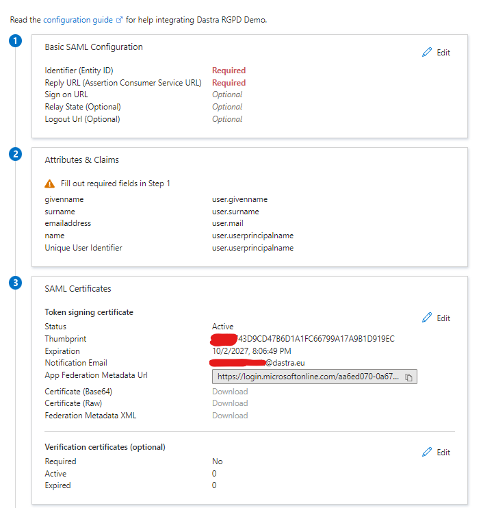
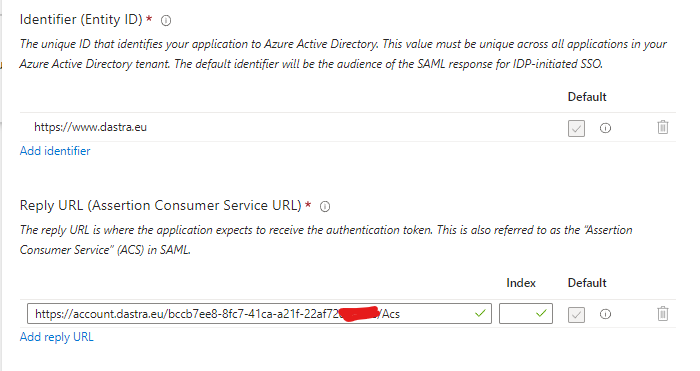
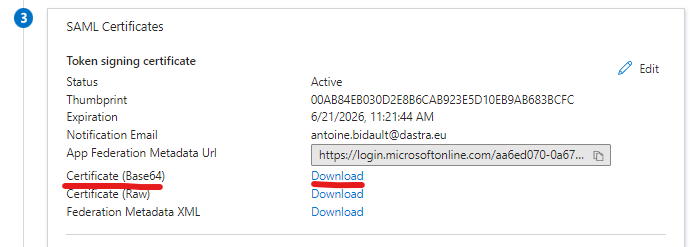
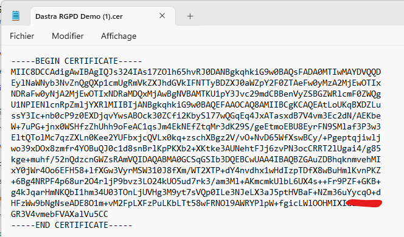
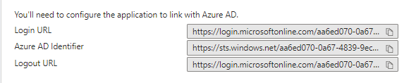
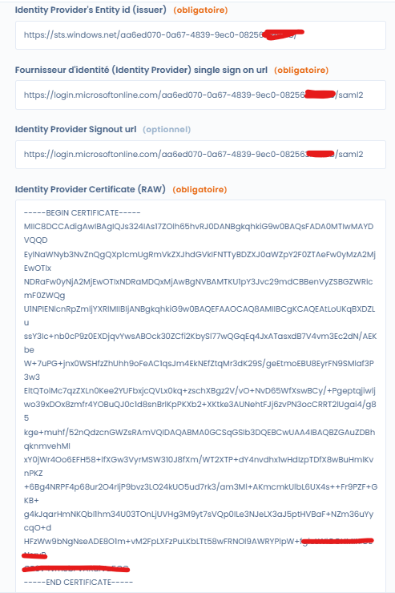

# Active Directory

## **Configuration of the application in the Azure portal**

* Go to the Microsoft Azure portal: [https://portal.azure.com/](https://portal.azure.com/)
* Click on Active Directory
* In the left navigation, click on Enterprise Applications
* Click on the **New application** button
* Then click on **Create your own application**
* Enter the name of the application, you can simply put "Dastra"
* Select the box "**Integrate any other application you don't find in the gallery (Non-gallery)**"
* Your application is created!
* Click on Single-Sign-On and select SAML
* **You will arrive to this page:**

<figure><figcaption></figcaption></figure>

## **SSO Client Configuration in Dastra**

### **Step 1: Create an OpenId SSO login in Dastra.**

* Go to the [Dastra SSO configuration page](https://app.dastra.eu/general-settings/sso)
* Click on "**Add an SSO login**"
* Select SAML as the "**SSO Protocol**" type
* Enter a connection label. For example, "Active Directory"

### Step 2: Configure the SSO login in Active Directory

* Return to the SAML configuration page of Active Directory
* Click on the **"Edit"** button in the first part.
* Enter the connection information (Entity ID and ACS Url) in the following way:

<figure><figcaption></figcaption></figure>

* Click on Save
* Go directly to part 3 to download the certificate in base64 format.

<figure><figcaption></figcaption></figure>

Open the CER file with your preferred text editor (for example, Notepad) and copy the content (CTRL + C).

<figure><figcaption></figcaption></figure>

### **Step 3: Add the Certificate to the Dastra Client**

* Return to the SAML connection creation screen in Dastra
* Paste the text of the certificate into the "Identity Provider Certificate (RAW)" field (CTRL + V)

### **Step 4: Configure the IdP URLs in Dastra**

* Copy the three links Entity Id, SSO Url, and Logout Url from step 4 of Active Directory
*

    <figure><figcaption></figcaption></figure>
* Copy the URLs following this scheme:
* Login URL => Single sign-on url
* Azure AD Identifier => Identity provider's Entity Id
* Logout Url => Identity provider Signout url
* Your SSO configuration form in Dastra should look like this:
*

    <figure><figcaption></figcaption></figure>
* Save your changes in Dastra.


Before testing the connection, make sure that a user is assigned to the new application.


### Test your SSO Connection

Then click on the "Test" button at the bottom of the form in the Active Directory. If everything works correctly, you should be redirected to the Dastra application.


If you have not activated automatic account provisioning, Dastra will deny access if the local account has not been created via an invitation.


### For further information


[known-problems.md](known-problems.md)



[saml-2.md](saml-2.md)

