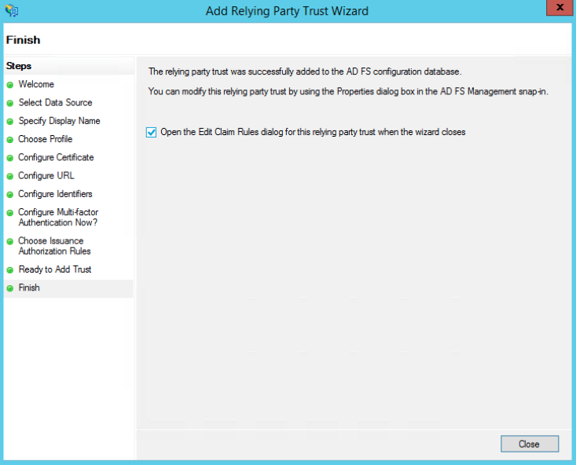

# ADFS

**What is ADFS?**

Active Directory Federation Services (commonly abbreviated as ADFS) are a single sign-on (SSO) solution designed by Microsoft. These services, a component of Windows Server operating systems, allow users to authenticate via Active Directory (AD) when they want to access an application that cannot use Integrated Windows Authentication (IWA).

**Configuration of ADFS in Dastra**

**Step 1: Create a SAML login in Dastra.**

* Go to the \[appropriate section]
* Click on "Add an SSO login"
* Select SAML as the "SSO Protocol" type
* In the "Identity Provider's Entity id (issuer)" field, enter the following URL:
* In the "Identity Provider single sign-on url" field, enter "/adfs/ls"

**Step 2: Retrieve the ADFS certificate**

* Go to the "Certificates" directory of the ADFS server
* Retrieve the .CER certificate of your ADFS server using the "Token-Signing" certificate.

<figure><figcaption></figcaption></figure>

* Click on "**View Certificates**".

<figure><figcaption></figcaption></figure>

Copy the X509 Certificate code by opening the CER file with a text editor. Insert the certificate code into the certificate field that starts with "----BEGIN CERTIFICATE-----" and ends with "----END CERTIFICATE-----". Your login configuration should look like this:

<figure><figcaption></figcaption></figure>

**Step 3:** Keep the following values:

* **SP redirect URI (format: https://account.dastra.eu/xxxxx-xxxx-xxxx-xxxx/Acs):** The SP redirect URI is the Application Callback URL (SAML Token will be posted here). The encoding supported are SHA-256 and higher.
* **Identity Provider's Entity id (issuer)**

These two values will be used to configure the ADFS server to accept SSO requests from Dastra.

**Configuration of Dastra Client in ADFS**

Here's how to configure Dastra SSO with ADFS SSO SAML2P:

**Step 1:** On your ADFS server, open "AD FS Management"

**Step 2**: Right-click on "Relying Party Trusts" and select "Add Relying Party Trust". This will launch the Relying Party Trust addition wizard.

<figure><figcaption></figcaption></figure>

**Step 3:** In the Select Data Source screen, choose Enter data about the relying party manually.

<figure><figcaption></figcaption></figure>

**Step 4:** Enter a Display name, for example, "Dastra," and then click "Next".

**Step 5:** Choose AD FS profile with SAML 2.0 and click "Next".

**Step 6:** Click "Next" on the Configure Certificate screen without selecting a certificate.

**Step 7:** Select "Enable support for the SAML 2.0 Web SSO protocol."

<figure><figcaption></figcaption></figure>

In the field "Relying party SAML 2.0 SSO service URL", enter the "SP redirect URI" URL from Dastra. This URL is in the form: https://account.dastra.eu/xxxx-xxxx-xxxx-xxxx/Acs Step 8: In the section "Add a Relying Party Trust Identifier", add two values: account.dastra.eu and [https://account.dastra.eu](https://account.dastra.eu/)

Step 9: Click next until the end of the process.

Step 10: Check the box Open the Edit Claim Rules dialog before clicking on "finish". An "Edit Claim Rules" window will then appear.

<figure><figcaption></figcaption></figure>

**Step 11:** Click on Add Rule and choose the "Claim Rule": "Send LDAP Attributes as Claims".\

<figure><figcaption></figcaption></figure>

**Step 12:** Map the claims as follows, the names of the claims may vary depending on the configuration of your server. Dastra needs three attributes to function: Email (Mandatory), User's First and Last Name.

<figure><figcaption></figcaption></figure>

**Step 13:** Click on "Finish" and then click again on "Add Rule". This time, choose the type "Transform an Incoming Claim" and click next.

**Step 14:** Configure the following rule: Email Address => Name ID => Email

<figure><figcaption></figcaption></figure>

Then apply the changes by clicking on "Apply".

**Step 15:** Back in the "AD FS Management" window, right-click on "Relying Party for Dastra" and choose "properties". In the Advanced tab, choose SHA-256 as the secure algorithm.

**Step 16:** You have succeeded!

End and Tests! Once everything is configured on both sides, you can return to Dastra and launch a test of SSO login directly in the manager.
