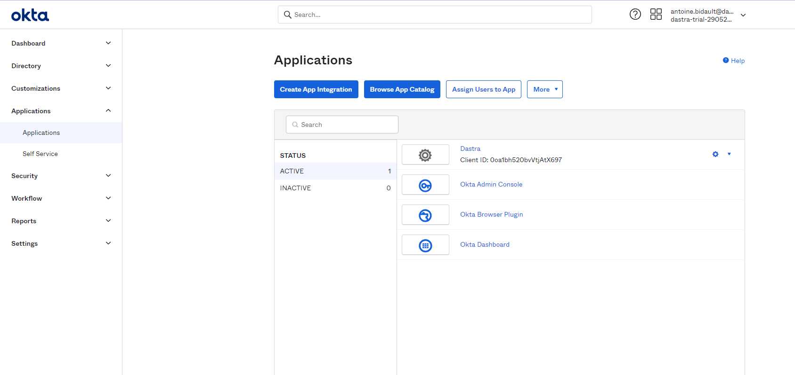
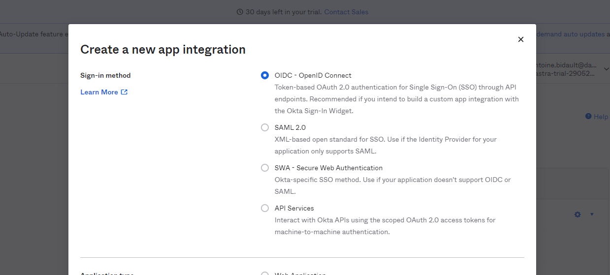
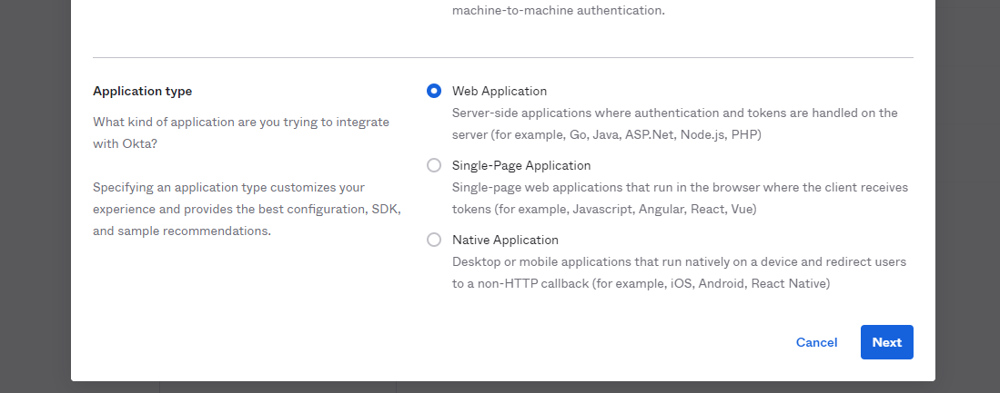
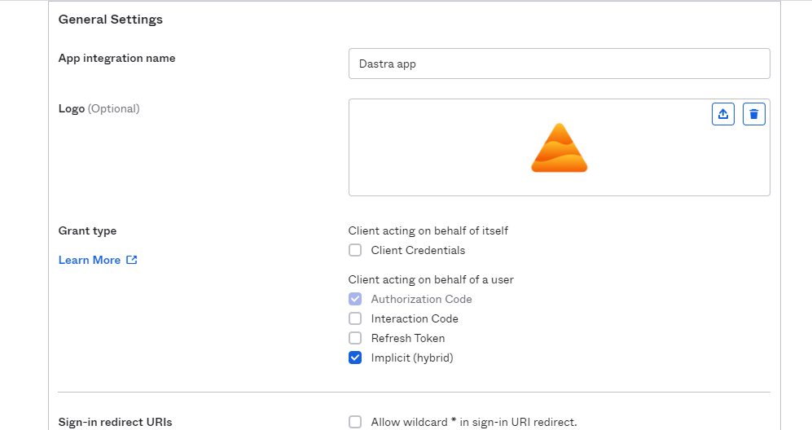

# Okta

Voici comment configurer le login Okta en SSO dans Dastra en utilisant le protocole O**penId Connect**. A noter, qu'il est également de le faire en utilisant SAML.

**Etape 1**: se rendre dans **le back-office administrateur Okta**

**Etape 2:** se rendre dans le menu **"Applications" > "Applications".** Cliquez sur le bouton **"Create App Integration"**

**Etape 3** : Sélectionnez "**OIDC - OpenID Connect**"

**Etape 3** : Sélectionnez le type d'application "**Web application**"

**Etape 4** : Configurez l'application de la manière suivante en cochant bien la case "**Implicite**"

Pour le logo de l'application, vous pouvez [utiliser celui-ci](https://www.dastra.eu/images/logo-dastra-dark.png)

Etape 5 : A ce stade, vous allez avoir besoin de configurer une url de redirection de Dastra dans votre application Okta. Pour cela, retournez dans l'application Dastra, dans la page de gestion du SSO.
