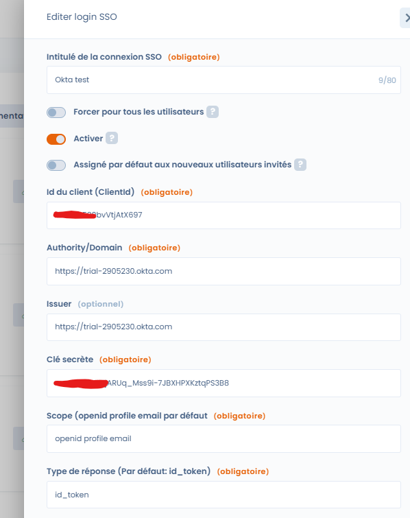

# Okta

Voici comment configurer le login Okta en SSO dans Dastra en utilisant le protocole **OpenId Connect**. A noter, qu'il est également de le faire en utilisant SAML.

**Etape 1**: se rendre dans **le back-office administrateur Okta**

**Etape 2:** se rendre dans le menu **"Applications" > "Applications".** Cliquez sur le bouton **"Create App Integration"**

**Etape 3** : Sélectionnez "**OIDC - OpenID Connect**"

**Etape 3** : Sélectionnez le type d'application "**Web application**"

**Etape 4** : Configurez l'application de la manière suivante en cochant bien la case "**Implicite**"

Pour le logo de l'application, vous pouvez [utiliser celui-ci](https://www.dastra.eu/images/logo-dastra-dark.png)

**Etape 5** : A ce stade, vous allez avoir besoin de configurer une url de redirection de _Dastra_ dans votre application _Okta_. Pour cela, retournez dans l'application _Dastra_, [dans la page de gestion du SSO](https://app.dastra.eu/general-settings/sso). Cliquez sur "**Nouveau login SSO**", et vers le bas du formulaire, vous avez une url de redirection qui s'affiche que vous devez copier.

**Etape 6** : Retournez dans Okta, et collez l'url de redirection dans le champ approprié, sélectionnez les utilisateurs Okta à qui vous souhaitez octroyer l'accès à Dastra (par défaut, vous pouvez cocher "Allow everyone") puis cliquez sur "**Save**"

**Etape 7** : Vous y êtes presque ! Vous êtes redirigé sur une page avec l'ensemble des settings de la nouvelle app SSO : Client Id, Clé secrète et domaine/autorité

&#x20;

**Etape 8** : Retournez dans **Dastra**, vous pouvez ainsi renseigner les champs de formulaire de la façon suivante :&#x20;

* **Id du client** : copier l'id du client de Okta&#x20;
* **Authority/Domain** : **Attention !** mettre le domaine avec le protocole (https://\*\*\*.okta.com).
* **Issuer** : laisser vide ! <mark style="color:blue;"></mark>&#x20;
* **Clé secrète** : Copier la clé secrète de Okta
* **Scope** : openid profile email &#x20;
* **Type de réponse** : id\_token

<mark style="color:blue;"></mark>

**Etape 8** : Cliquez sur "Enregistrer" => Puis lancez un test ! Si vous êtes bien redirigé
