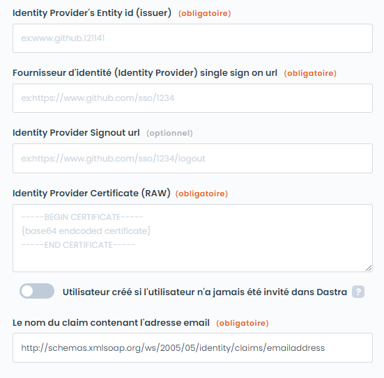

# SAML 2

The configuration of SSO with SAML 2 is done in three steps:

1. Configuration of the Authentication Provider (Identity Provider - IdP): Active Directory, Google Workspace, etc.
2. Configuration of the Service Provider (Service Provider - SP): Dastra
3. Testing of the authentication

In the specific case of ADFS servers, consult our specific documentation:


[adfs.md](adfs.md)


1. Authentication Provider Configuration

You need to set up a SAML configuration in your authentication provider.

* For AD FS: [https://docs.microsoft.com/fr-fr/powerapps/maker/portals/configure/configure-saml2-settings](https://docs.microsoft.com/fr-fr/powerapps/maker/portals/configure/configure-saml2-settings)
* For Azure AD: [https://docs.microsoft.com/fr-fr/powerapps/maker/portals/configure/configure-saml2-settings-azure-ad](https://docs.microsoft.com/fr-fr/powerapps/maker/portals/configure/configure-saml2-settings-azure-ad)
* For Google: [https://support.google.com/a/answer/6087519?hl=fr](https://support.google.com/a/answer/6087519?hl=fr)

To link the local accounts (those hosted in Dastra), you need to provide a property containing the user's email (by default, Dastra looks for the property named [http://schemas.xmlsoap.org/ws/2005/05/identity/claims/emailaddress](http://schemas.xmlsoap.org/ws/2005/05/identity/claims/emailaddress)).

Here are the details you need to configure the service provider:

* Identity Provider's Entity id (issuer)
* Single sign-on url
* The certificate in RAW format (Base64 encoded)

To configure your authentication provider, you will need the following information:

* Issuer: by default "[https://www.dastra.eu](https://www.dastra.eu/)"
* SP Redirect URI: by default [https://account.dastra.eu/Saml2/Acs](https://account.dastra.eu/Saml2/Acs)

2. **Configuration of the Service Provider**

In dastra.eu, go to the SSO administration page and click on "add an SSO login".

Fill in the form fields using the information from the entity configuration:

<figure><figcaption></figcaption></figure>


It is possible to force all users of the subscription account to use a particular SSO (by checking the box "force users to use this SSO"). Be cautious before activating this option, as if the SSO malfunctions, you will no longer be able to access your account as an administrator. It is preferable to manage the SSO on a per-user basis.



**Special Cases of External Users**

Only accounts that are internal to a subscription will be subject to the SSO. Accounts of external users (who have an additional subscription) will not be subject to the SSO.


3. Testing the SSO

Once the configuration is complete, you can test the authentication by clicking on the test button at the bottom right. If you encounter any problems during the SSO configuration, do not hesitate to approach support by going to the [support ticket management page](https://app.dastra.eu/general-settings/support).
