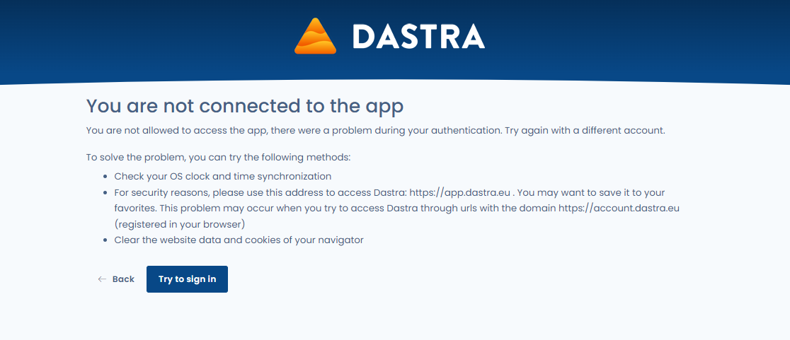

# Known problems

## Resolve problems with your browser's cache

When you use a browser, it uses cache and cookies to store information from websites. Deleting them fixes some problems, such as those related to loading applications like Dastra.

To solve these problems, we provide you with several solutions:

1. **Update your browser**, using CTRL + F5 (or MAC + F5)&#x20;
2. If the first solution does not work, **reset your preferences**. This action will allow you to easily delete cookies set by Dastra, clear items from your local storage, and reset your display preferences in Dastra, and may help resolve some display problems and bugs.

To activate it, go to the "profile" tab in your personal settings:

<figure><figcaption></figcaption></figure>


Selecting this option will cause you to lose your column settings in all Dastra tables and re-trigger the display of tutorials in all modules.


These two actions did not solve your problem? Contact the support directly from the application, via chat or the "megaphone" tab.

## 401 error during connection

**Scenario** : you connect to Dastra via the url https://app.dastra.eu, you enter your login and you arrive on an error page "**Access denied (401)**" .&#x20;

Preview of the page:

<figure><figcaption></figcaption></figure>

**Solutions**:&#x20;

1. **Check your computer's clock settings**. It's strongly recommended to activate the time synchronization with the internet. Indeed, the expiration times of your identification tokens are compared to the time of your machine. If the date is not well synchronized with the server time, you will encounter this error. To configure your clock, go to the following links:
   * [Mac](https://support.apple.com/en-ca/guide/mac-help/mchlp2996/mac)
   * [PC](https://support.microsoft.com/en-us/windows/how-to-set-your-time-and-time-zone-dfaa7122-479f-5b98-2a7b-fa0b6e01b261)
2. **Use this address to access Dastra: https://app.dastra.eu** . You can save it to your favorites. This problem may occur when you try to access Dastra through urls with the domain account.dastra.eu (often automatically saved in your browser's url suggestions)
3. **Clean up your browser's site data and cookies**
